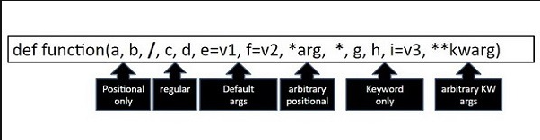
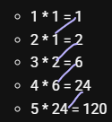

Use the slice Operator
You can also make a copy of a list by using the : (slice) operator.

thislist = ["apple", "banana", "cherry"]
mylist = thislist[:]
print(mylist)


		 Validate email:


import re
email = "test@example.com"
print(bool(re.match(r".+@.+\..+", email)))  # True

		Strong password check:	
import re
password = "Abc123!"
print(bool(re.match(r'^(?=.*[A-Za-z])(?=.*\d)[A-Za-z\d@$!%*#?&]{6,}$', password)))  
# True if 6+ chars, letters & numbers


In Python, "guards" usually mean:


bcz 2nd parma never reach that value so in order to reach that instead of write a number ahead we can do it like 1+10 now it can reach reach 10 even it is a variable

the the pram will add that number in each itration like 
num, = 10

 for i in range (1, 1+num,3):
 print( i )#1,4,710


\r = carage treturn it remove prevous words == doublesecet & move on


Ordered: Lists are ordered, meaning that the items in the list have a specific order and can be accessed by their index.
Mutable: Lists are mutable, meaning that they can be modified after they are created.
Indexed: Lists are indexed, meaning that each item in the list has a specific index that can be used to access it.
Dynamic size: Lists can grow or shrink dynamically as elements are added or removed.
Heterogeneous: Lists can contain elements of different data types, such as integers, strings, floats, and other lists.
Supports duplicate values: Lists can contain duplicate values.

fruits: list = ["apple", "banana", "cherry"]
print(fruits[0])   # Output: apple
print(fruits[-3])  # Output: apple, accessing element in reverse order


append vs extend 
apnd 4 single value | x6tnd  4 multiple elemnts

Feature | pop() | remove()
Based on | Index | Value
Return value | Yes (removed item) | No (returns None)
Error if... | Index out of range | Value not found
Default use | Removes the given index item if not given so last item | Removes first matching value


pop give error if not found but ve can handle it grace fully on the 2nd index where we ca n define what to say if not found either -1 or any other msg like "No such item found"
pop()	Removes the element with the specified key
popitem()	Removes the last inserted key-value pair
warnig:

You can't do it with a single remove().
remove() deletes only first match.

To remove all, you must loop or use list comprehension.


Here’s both ways ⚡:

**Loop way**  
```python
lst = [1, 2, 1, 3]
while 1 in lst:
    lst.remove(1)
```

**List comprehension way**  
```python
lst = [x for x in lst if x != 1]
```
also we can do this with filter

lst = list(filter(lambda x: x != 1, lst))

			Sort


	Ascending Order
numbers: list[int] = [3, 1, 4, 1, 5, 9] # unsorted list
numbers.sort()
	Descending Order
numbers.sort(reverse=True) or numbers.reverse()
	String Length (shortest one first)
words.sort(key=len)
	String Length (longest one first)
words.sort(key=lambda word: word[-1])


			Using list comprehension
List comprehension is a powerful feature in Python that allows you to create new lists in a concise way. It's a compact way to create lists from existing lists or other iterables by applying a transformation or filter to each element.
Syntax
new_list = [expression for element in iterable if condition] (if condition is opnitional)

Python  to store collections of data using
1>> Tuple
2>> Set
3>> List
4>> Dictionary
# Tuple 
**Hashable**: Tuples can be used as keys in dictionaries because they are immutable.
👑 **allow duplicate** Tuples allow duplicate values:


Even though tuples are immutable, Python may create new instances in memory when you define identical tuples in separate assignments. This is why id(tuple_1) and id(tuple_2) may differ.
id(tuple_1) =  139975700916672
id(tuple_2) =  139975700971648
tuple_1 == tuple_2 =  True

## working methods on tuples

we can`t modify tuple but create a new tuple from that with the 
modification 
like i did 
```py
# Tuple slicing
print("tuple2[1:] =", tuple2[1:])  # Slicing from index 1
treter = tuple2[1:] #tuple2[1:] = (20, 30)
print("🎈",treter , type(treter)) # 🎈 (20, 30) <class 'tuple'>
 ```
 also 
**tuple + tuple = tuple**
```py
using dir() without "__"
it only give 2 mtds 
1: 'count'
2: 'index'
```
```py
tuple3: tuple = tuple1 + tuple2 
print("tuple1 + tuple2 =", tuple3)#tuple1 + tuple2 = ('apple', 'banana', 'cherry', 10, 20, 30)
 ```
**tuple nesting is different form tuple concatenation**
```py
# Nested tuples
nested_tuple = (tuple1, tuple2)
print("nested_tuple =", nested_tuple) #(('apple', 'banana', 'cherry'), (10, 20, 30))
means 2 tuples (),() inside a tuple () ==> ((),())
 ```
 # Repeating tuples
tuple4: tuple = tuple2 * 2
print("tuple2 * 2 =", tuple4)


# Unpacking tuples
a, b, c = tuple1
print("Unpacking tuple1:", a, b, c)
# Using tuples as keys in dictionaries (because they are immutable)
my_dict = {tuple1: "This is a tuple key", tuple2: "Another tuple key"}
print("Dictionary with tuple keys:", my_dict)

## forbidden methods on tuples
tuple1.sort()
tuple1.reverse()
tuple1.append("mango")
tuple1.extend(["grape", "kiwi"])
tuple1.remove("banana")
deleted = tuple1.pop(1)

To create a tuple with only one item, you have to add a comma after the item, otherwise Python will not recognize it as a tuple. -------------
                    |
```py               v 
thistuple = ("apple",)
print(type(thistuple))

#NOT a tuple
thistuple = ("apple")#tuple
print(type(thistuple))#str
```
It is also possible to use the tuple() constructor to make a tuple.

```py
thistuple = tuple(("apple", "banana", "cherry")) # note the double round-brackets
print(thistuple)
```

# Dict

Un-indexed: Items are accessed using keys, not indices.
Without duplicates: Keys must be unique, but values can be duplicated.
**way to access** car["model"] no dots here
but There is also a method called get() that will give you the same result

car =	{
  "brand": "Ford",
  "model": "Mustang",
  "year": 1964
}
print(
car.get("model")
)
**way to add new key/vl pari or to modify existing key** # Add person["email"] = "alice@example.com"

It is also possible to use the dict() constructor to make a dictionary.

```py
thisdict = dict(name = "John", age = 36, country = "Norway")
print(thisdict)
```
The items() method will return each item in a dictionary, as tuples in a list.
```py
x = thisdict.items()# dict_items([('brand', 'Ford'), ('model', 'Mustang'), ('year', 1964)])
```
**fromKeys()**
Syntax
dict.fromkeys(keys, value)
Parameter Values
Parameter	Description
keys	Required. An iterable specifying the keys of the new dictionary
value	Optional. The value for all keys. Default value is None
```py
x = ('key1', 'key2', 'key3')
y = 0
thisdict = dict.fromkeys(x, y)
print(thisdict)#{'key1': 0, 'key2': 0, 'key3': 0}
```

## Python dict comprehension syntax
```py
{key: value for item in iterable}
```
```py
celsius_temps = [0, 10, 20, 30, 40]
fr = {str(r) + "c": str((r * 9/5) + 32) + "f" for r in celsius_temps}
```

# set
A set is:

unordered
unindexed
mutable
but unique 🌟
Note: to create an empty set you have to use set(), not {}
can create using set constructor set() like: my_set2: set = set([123, 452, 5, 6])
✔ A set can store only immutable objects such as number (int, float, complex or bool), string or tuple. 

❌If you try to put a list or a dictionary in the set collection, Python raises a TypeError.<!-- TypeError: unhashable type: 'list -->
"Python sets are unordered collections,the way elements are stored in memory depends on hashing, which can lead to unpredictable ordering. but from hash point of view they r orderd"
since set os unorder so we cant  call them, from their indexs 
also set object does not support item assignment my_set[0] = 10

```py
my_set: set = {1, 2, 3, 4, 5, 'A', 'a'} 
# Remove an item
my_set.remove(3)# Output: {1, 2, 4, 5 , 'A','a'}
my_set.remove('A') # Output: {1, 2, 4, 5,'a'}
my_set.add(6)# Output: {1, 2, 4, 5, 6}
#discard() only removes a single element otherwise accepted 1 arg but got 3
```
to take union() of two sets: we use union() method or 
The | operator is a binary operator that can be used to combine two sets into a single set. It has the same effect as the union() method, but is often more concise and readable.
```py
my_set: set   = {1, 2, 3, 5}
my_set_2: set = {1, 5, 6, 7}
my_set3: set  = my_set.union(my_set_2)
my_set3: set  = my_set | my_set_2 #same output
```
**remove() vs discard() vs difference_update() vs pop() methods:**

remove() method:

The remove() method removes the specified item from the set.
If the item is not found in the set, it raises a KeyError.
This method is suitable when you are sure that the item exists in the set.
discard() method:

The discard() method also removes the specified item from the set.
However, if the item is not found in the set, it does not raise any error. It simply does nothing.
This method is suitable when you are not sure if the item exists in the set.

difference_update() to remove multiple items at once 
```py
my_set: set = {1, 2, 3, 4, 5, 'A', 'a'}
print("Before: my_set = ", my_set)
my_set.difference_update({1, 5, 3, 'A'})
print("After:  my_set = ", my_set)#{2, 4, 'a'}
```
Pop():removes and returns an random element from the set.

update(): to add multiple methods but difference update uses {}
& this one uses []
```py
print("Before: ", my_set)#Before:  {1, 2, 3, 4, 5, 6, 'Hello! World'}
# Add multiple items
my_set.update([7, 8, 9, "Hello"])
print(my_set)  #{1, 2, 3, 4, 5, 6, 7, 8, 9, 'Hello', 'Hello! World'}
```
**The Hashing**
Hashing is a mechanism in computer science which enables quicker searching of objects in computer's memory. Only immutable objects are hashable.

Immutable data types in Python come with a built-in method for computing their hash value, which is called hash.

A hash table is a data structure that can map keys to values and that implements a hash function to compute the index to an array of buckets or slots
```py
a: str = "Hello! World"
b: str = "Hello! World"

print("id(a) = ", id(a))#id(a) =  132467750244336
print("id(b) = ", id(b))#id(b) =  132466877525360
print("hash(a) = ", hash(a))#hash(a) =  9090330697819382555
print("hash(b) = ", hash(b))#hash(b) =  9090330697819382555
print("hash(a)      = ",hash(a))#hash(a)      =  9090330697819382555
print("a.__hash__() = ", a.__hash__()) # __dunder__() output is same here
```
Even if a set only allows immutable items, the set itself is mutable.
In Python, a dictionary key must be an immutable object,  because dictionaries use a hash table to store key-value pairs, and *__mutable objects cannot be hashed.__*
& wecant store set in dict`s keys

adding/removing elements may trigger rehashing, leading to reallocation of storage

###### Sets are unordered, but as of Python 3.7+, they maintain insertion order while internally relying on hashing."

# O(1) or constant time complexity
an algorithm takes the same amount of time to execute, regardless of the size of the input
Number of operations needed to run an algorithm on 

## Frozenset
still unique& unordered but hashable & immutable
**Thread safety:**
set: No Thread safety: Can lead to in consistency
frozenset: Thread-safe: due to immutability

**Modification methods:**

set: Supports methods like add(), remove(), discard(), clear(), pop(), update()
frozenset: Does not support any modification methods
**Syntax:**

set: Created using the set() constructor or the {} syntax (e.g., my_set = {1, 2, 3})
frozenset: Created only using the frozenset() with [] instead of {} (e.g., my_frozenset = frozenset([1, 2, 3]))]

```py
my_frozenset: frozenset = frozenset([1,2,3, "Hello! World"])
print("my_frozenset  = ", my_frozenset)

my_set: set = {1,2,3, "Hello! World"}
my_frozenset2: frozenset = frozenset(my_set)
print("my_frozenset2 = ",my_frozenset2)
```

>>> cannot be used as keys in dictionaries or elements in other sets
>>> can be used as keys in dictionaries or elements in other sets

# Garbage Collection:
garbage collector is a Memory Management System that automatically frees up memory occupied by objects that are no longer needed or referenced. This helps prevent memory leaks (like my private keys left in ram after runing program in collab & other user come & .....)

**how to use it manually**
```py
import gc

gc.collect()
print(gc.get_count()) #(         43,                 0,                   0)
                                 ⬆					 ⬆					  ⬆
# prints the number of collected objects, unreachable objects, and reference cycles
```
In some cases it is not perfect

Automatic: You don't need to manually manage memory or explicitly free up memory.

Periodic: The garbage collector runs periodically to clean up memory.

Reference-based: It uses reference counting to determine which objects are no longer needed.
 
 # Thread safety = Code handles parallel tasks correctly (no crashes, no bad data),


---
# Modules
1. built-in
2. User define (custom)
3. External

| Import Style           | Bytecode Impact | Readability | Performance |
|------------------------|-----------------|-------------|-------------|
| import module          | ✅ Minimal       | ✅ Clear     | ✅ Fast      |
| from module import *   | ❌ Bigger        | ❌ Confusing | ❌ Slower    |
| from math import pi | ✅ Lean & Clear  | ✅ Clear     | ✅ Efficient |


---
**who will win ???**
```py
from math import *
from numpy import *
print(pi)  # Which `pi` is being printed? math.pi or numpy.pi?
```
The last imported pi takes precedence bcz of interpreted language (line by line )

**Import with Alias (as)** to call with nick name

# both module & func is used for modularity

# def
A Python function is a block of organized, reusable code that is used to perform a single, related action
normally funs are stateless but glocbal funcs can be both stateless/full
### **Global Scope**
**module-level scope**
defining A function at the top level of the module make that func global then we can call/access it from anywhere in that module 
and if the module is imported into another file, the function can be accessed from there as well.

**Global funcs can be stateful or stateless.**  
If they use global vars ⇒ **stateful**.  
If they don’t ⇒ **stateless**.
**How to create  global variables**
Adding global  keyword before var name inside a function making that local var global & it will be accessibly outside also

`return` exits the function and gives back a value to the caller. It can be stored in variables for future use.

**Types of Python Functions**
## Builtin:
Some of Python's built-in functions are print(), int(), len(), sum(), etc. These functions are always available, as they are loaded into computer's memory as soon as you start Python interpreter.

### Functions defined in built-in modules
 These functions are not readily available. You need to import them into the memory from their respective modules.
```py
import random
print(random.random())
```
###  User-defined functions
```py
def my_function():
  print("Welcome to Operation Badar")
my_function()
```


### IS docstring is just for comments

No — **docstring ≠ comment.**

- **Docstring**: special string for documentation, read by tools (`help()`, IDEs, Sphinx, etc.).
- **Comment** (`#`): for devs only, not shown by `help()`.

Use docstring if you want your func to be self-documented.
it is  Used for documentation, accessible via help(add).
**Syntax**
```py
def function_name( parameters ):
   "function_docstring"
   function_suite
   return [expression]
```
- function suite = the block of code inside the function.
return is part of the suite
-  return expression = the value or calculation that a function returns when called.
- to give return type use `-> return_type:` after parameters

- Function expression = assigning a function to a variable.
```py
add = lambda a, b: a + b
```

Function Expressions vs. Function Statements
Feature
Function Statement (def)| Function Expression (lambda)
Syntax
def function_name(parameters): \n body | lambda parameters: expression
Name
Requires a name | Anonymous (no name)
Body
Can contain multiple statements | Limited to a single expression
Use Cases
General-purpose functions | Short, simple operations, often used with higher-order functions
Return Value
Explicit return statement or implicit return None | Implicit return of the expression's value


```py
def greetings():
   "This is docstring of greetings function"
   greet = 'Hello World!'
   return greet

message = greetings()
print(message)
```

## Pass by reference or value??
```python
# Immutable example
def change_num(x):
    x = x + 1
    print("Inside:", x)

a = 5
change_num(a)
print("Outside:", a)
```
Output:
```
Inside: 6
Outside: 5
```
`a` didn't change outside — **immutable**.


---

```python
# Mutable example
def change_list(lst):
    lst.append(4)
    print("Inside:", lst)

b = [1, 2, 3]
change_list(b)
print("Outside:", b)
```
Output:
```
Inside: [1, 2, 3, 4]
Outside: [1, 2, 3, 4]
```
`b` changed outside — **mutable**.

---


change_num: pass by reference, but int is immutable, so it acts like pass by value.
(no real change outside)

change_list: pass by reference, list is mutable, so it really changes outside.

In Python:

Everything (even int, str) is passed by object reference.

But if the object is immutable (int, str, tuple), you can't change it — it looks like pass by value.

If mutable (list, dict), you can change it — real pass by reference behavior.

👉 Real rule:
Python always passes references to objects.

Whether you can modify the object depends on if it's mutable or immutable.
## Keyword Arguments
we can change the order while calling or we can skip any if we want bcz py interpreter can match the provided keyword with parameter
```py
def printinfo( name, age ):
   "This prints a passed info into this function"
   print ("Name: ", name)
   print ("Age ", age)
   return

# Now you can call printinfo function
printinfo( age=50, name="Arif" )
#printinfo(50, "Arif" )
```

## * unpacking iterables
In Python, the * operator is used for unpacking iterables (like lists, tuples, or sets) into individual elements. When you use * before a list (or any iterable) in a function call, it unpacks the list and passes its elements as separate positional arguments to the function
Unpacking (*something) → doesn't always output a tuple.
But in def func(*args), the packed result is always a tuple.
```py
def add(*nums):
    return sum(nums)
print(add(1, 2, 3))  # 6
# or  

def my_sum(*nums):
  print(type(nums),", ", nums)

  return sum(nums)

print("Sum     = ", my_sum(1,2,3,4,5,8,5),"\n")
print("Sum *[] = ", my_sum(*[1,2,3,4,5,8,5]), "\n") # *  unpacking list
print("Sum *() = ", my_sum(*(1,2,3,4,5,8,5))) # *  unpacking tuple

```


**default args**
- use = for this: def printinfo( name, age = 35 ):**

## **positional-only arguments `/` **
are function parameters that must be passed in same order as the parameters are passed, And without their names (means without key arguments )

### Syntax:
Use `/` in the function signature:

```py
def func(a, b, /, c, d):
    pass
```

### Meaning:
- `a` and `b` → **positional-only**
- `c` and `d` → can be **positional or keyword**

### Example:
```py
def greet(name, /):
    print(f"Hello, {name}!")

greet("Alice")     # ✅
greet(name="Bob")  # ❌ TypeError
```

### Why use it?
- Enforce API clarity
- Match behavior of some C functions
- Prevent misuse of keyword args
 

## **Keyword-only arguments`*`**
Must be pass with their names otherwise error
```py
def posFun(*, num1, num2, num3):
    print(num1 * num2 * num3)

print("Evaluating keyword-only arguments: ")
posFun(num1=6, num2=8, num3=5)

posFun(num3=6, num1=8, num2=5)


# TypeError: posFun() takes 0 positional arguments but 3 were given
#posFun(6, 8, 5)
```

## **Arbitrary/Variable-length args** let you pass any number of values.

#### 1. `*args` → non-keyword (tuple)
```py
def add(*nums):
    return sum(nums)

add(1, 2, 3)  # 6
```

#### 2. `**kwargs` → keyworded (dict)
```py
def show(**info):
    print(info)

show(name="Alice", age=30)
# {'name': 'Alice', 'age': 30}
```

---

### TypeScript/JS Equivalent:

#### 1. **Rest parameters**:
```ts
function add(...nums: number[]) {
  return nums.reduce((a, b) => a + b, 0);
}

add(1, 2, 3); // 6
```

#### 2. **Object for keyword-like args**:
```ts
function show(info: { [key: string]: any }) {
  console.log(info);
}

show({ name: "Alice", age: 30 });
```

Same idea, diff syntax.
---
| `*args` / `**kwargs` | ✅ only while creating  function  |
|----------------------|------------------------------------|
| `*list` / `**dict`   | ✅ only while **calling**   function       |
---
`Return`:reduced indent after the last statement in the block also implies return but using explicit return is a good practice.

# The Anonymous Functions
anonymous function = when it is not declared in the standard manner by using the def keyword
**Syntax**
The syntax of lambda functions contains only a single statement, which is as follows −
```py
add_numbers = lambda arg1, arg2: arg1 + arg2
result = add_numbers(1, 2)
print(result)#3
```
- Lambda functions cannot contain statements like print, if, for, or while.

Feature|	Python (lambda)	|JavaScript/TypeScript (=>)
Syntax |	lambda args: expression | (args) => expression
Multi-line?	| ❌ (One-liner only) | ✅ (Supports blocks {})
Scope |	No return, only expressions |	Supports {} with return

# help(add):

```python
def add(a, b):
    """Adds two numbers."""
    return a + b

help(add)
```

Running `help(add)` prints the docstring:  
```
Help on function add:

add(a, b)
    Adds two numbers.
```
# Generator Function
A generator function is defined like a normal function but uses the yield keyword instead of return.
but we can also use return
> A **generator** is like a media player:
- `yield` = ▶️ pause here & give this value
- `next()` = ⏯️ resume from pause  
- `return` = 🔌 power off the player  
-  = end of playlist (no more next)

---

### 🔸 Normal Function (returns all at once)

```py
def get_nums():
    return [1, 2, 3]

print(get_nums())  # [1, 2, 3]
```

---

### 🔸 Generator Function (yields one by one)

```py
def get_nums():
    yield 1
    yield 2
    yield 3

g = get_nums()
print(next(g))  # 1
print(next(g))  # 2
```

- Creates a **generator object**
- **Lazy evaluation** (saves memory)
- Use `next()` to step through

---

### 🔹 Key Points:

| Keyword   | Meaning                        | Analogy           |
|-----------|--------------------------------|--------------------|
| `yield`   | pause & return a value         | ▶️ pause & play    |
| `next()`  | resume from last `yield`       | ⏯️ resume playing  |
| `return`  | stop generator, end iteration  | 🔌 power off       |
|`StopIteration error` | if no iteration left  | 🔺 battery end |
---
## Generator Expressions/comprehensions
Generator expressions are a concise way to create generators. They are similar to list comprehensions but use parentheses instead of square brackets.
```py
# Create a generator expression that multiplies each number by 2
gen = (x * 2 for x in range(3))

# Print the type of 'gen', it will show it's a generator
print(type(gen))

# Iterate over the generator
for value in gen:
    # Print each value generated
    print(value)
```

# 🔹 Multi-Type Return in Python

Python functions can return **multiple values** of different types by using a **tuple**, **list**, **dict**, or custom object. it put all type in tuple before returning

Example:
```py
def get_data() -> tuple[int, list[str], dict[str, int]]:
    return 200, ["ok"], {"count": 1}

print(get_data(), type(get_data()))#(200, ['ok'], {'count': 1}) <class 'tuple'>

```
# Order of args in function



### 🔹 Python Name Resolution (LEGB Rule)

Python looks for names in this order:

- **L** → Local (inside current function)  
- **E** → Enclosing (outer function in nested funcs)  
- **G** → Global (module level)  
- **B** → Built-in (e.g., `len`, `sum`)

| Situation                | Python Looks Where First | Then...                       |   |
|--------------------------|--------------------------|-------------------------------|---|
| Inside a function        | Local (L)                | Enclosing → Global → Built-in |   |
| Inside a nested function | Local (L)                | Enclosing (E) → G → B         |   |
| Outside any function     | Global (G)               | Then Built-in (B)             |   |

- **Fibonacci sequence** is a series of numbers where each number is the sum of the two preceding ones: 0, 1, 1, 2, 3, 5, 8, 13, ...


Recursive Function: the function calls itself inside its own body.
it keeps calling util base case wont reach 
Key Components of a Recursive Function
Base Case: The condition that stops the recursion.
Recursive Case: The part of the function where it calls itself with a modified input.
for eg factorial of a number
The **factorial of a number** n (denoted as n!) is the product of all positive integers from 1 to n. It can be defined recursively as:

n! = n * (n-1)! (Recursive Case)
0! = 1 (Base Case)
```py
def factorial(n):#take n from user
    # Base case
    if n == 0: # return 1 if n = 0
        return 1
    # Recursive case
    else:#otherwise 
        return n * factorial(n - 1)

# Example usage
print(factorial(5))  # Output: 120
```
